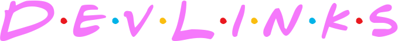
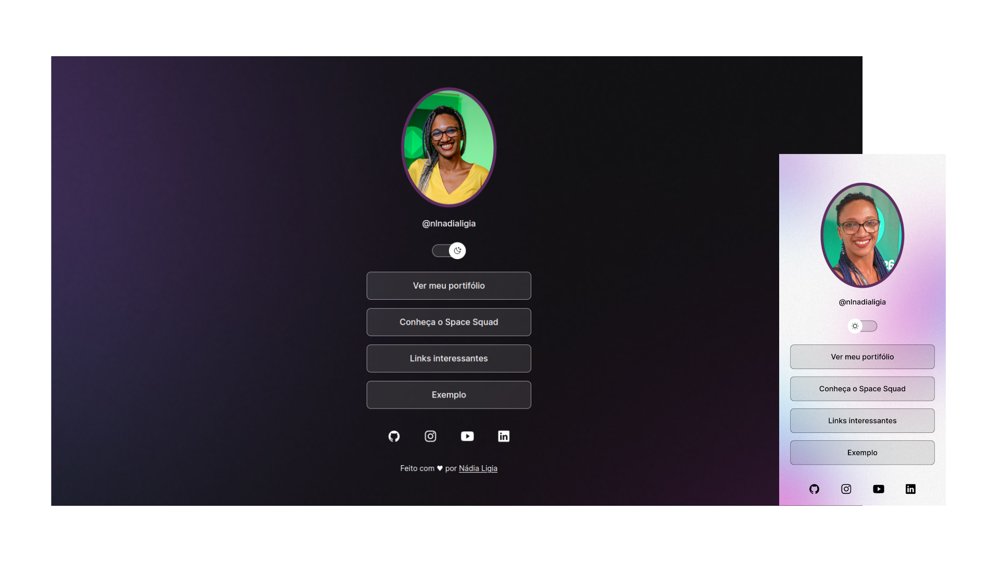

  

<h1  align="center">

</h1> 

  

## 🚀 Tecnologias

Esse projeto foi desenvolvido com as seguintes tecnologias:

- HTML e CSS
- JavaScript
- Git e Github
- Figma

 

## 💻 Projeto

O DevLinks é um agregador de links para usar como cartão de visitas online.

- [Acesse o projeto finalizado, online](https://nlnadialigia.github.io/devlinks/)

 

## 🔖 Layout

Você pode visualizar o layout do projeto através [DESSE LINK](https://www.figma.com/community/file/1187422022288947321). É necessário ter conta no [Figma](https://figma.com) para acessá-lo.

 

## 👩‍💼 Autora

<b>Nádia Ligia, back-end developer.</b>

&nbsp;&nbsp;
&nbsp;&nbsp;
